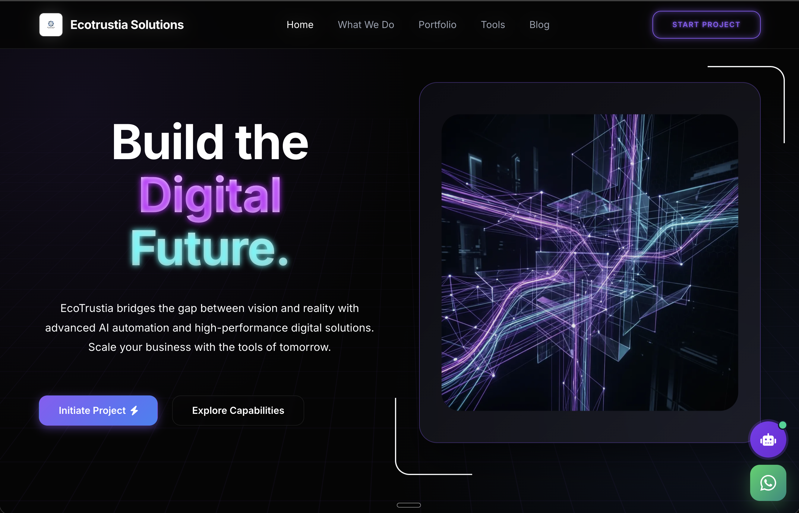

# Ecotrustia Solutions

A premier digital agency platform and high-fidelity utility suite built with **Next.js 15**, **Tailwind CSS**, and **TypeScript**. 



Ecotrustia Solutions specializes in architecting high-scale digital ecosystems, offering advanced agency services alongside a state-of-the-art glassmorphic "Neural Workbench" that provides a centralized hub for developer productivity.

## 🚀 Live Platform
https://ecotrustia-solutions.vercel.app/

## 🏢 Agency Services
As a high-performance digital agency, we specialize in:
- **AI Development & Automation**: Intelligent systems and workflows.
- **Web3 & Blockchain**: Decentralized applications and smart contracts.
- **Full-Stack Web & Mobile Engineering**: Scalable, modern application architecture.

## 🛠 Neural Workbench Features

The integrated workbench includes 40+ professional-grade tools across multiple categories:

### 📐 Engineering & Science
- **Temperature Converter**: Bi-directional scaling between Celsius, Fahrenheit, and Kelvin.
- **Scientific Calculator**: High-precision mathematical synthesis.
- **Unit Converters**: Length, Weight, BMI, and Calories.

### 🖼 Media Processing
- **Image Compressor**: Client-side high-fidelity compression.
- **Background Remover**: AI-powered element extraction.
- **Video & Audio Converters**: Cross-format media transposing.
- **PDF Suite**: Merge, compress, and convert (Word/Excel/PPT to PDF).

### ⌨️ Developer Utilities
- **Placeholder Synthesizer**: Premium Lorem Ipsum generation for UI/UX mapping.
- **Password Generator**: High-entropy security key synthesis.
- **QR Code Engine**: Instant vector-based code generation.
- **JSON & Data Tools**: Transformers and validators.

### 📱 Social Media Transposers
- **Downloaders**: Instagram, YouTube, and Facebook media extraction.

## 🎨 Design Philosophy
- **Glassmorphism**: 24px-48px backdrop blurs with 8% white borders.
- **7:5 Architectural Grid**: Optimized for workflow ergonomics.
- **Purple/Indigo Protocol**: A unified color system for visual consistency.
- **Fully Responsive**: Fluid layout scaling across all device nodes.

## 🛠 Tech Stack
- **Framework**: Next.js 15 (App Router)
- **Styling**: Tailwind CSS 4.0
- **Icons**: React Icons (Fa, Io, Md)
- **Deployment**: Optimized for Vercel

## ⚙️ Development

1. **Clone the repository**:
   ```bash
   git clone https://github.com/ahmed-ali-codes/ecotrustia-solutions.git
   ```

2. **Install dependencies**:
   ```bash
   npm install
   ```

3. **Environment Setup**:
   Copy the example environment file and fill in your details (especially the JWT secret and Vercel Blob token):
   ```bash
   cp .env.example .env.local
   ```

4. **Run the development server**:
   ```bash
   npm run dev
   ```

## 📄 License
Proprietary - All Rights Reserved.

You may view the code for educational and demonstration purposes, but you may not use, modify, distribute, or reproduce any part of this software for commercial purposes without explicit permission.

---
*© 2026 Ecotrustia Solutions. All Rights Reserved.*
